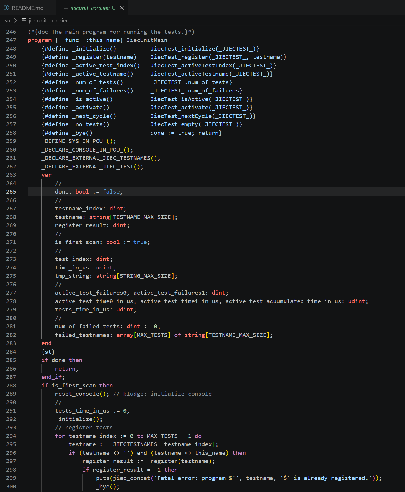

# IEC 61131-3 for Visual Studio Code

[](https://marketplace.visualstudio.com/items?itemName=graviness.iec-61131-3)
[](https://marketplace.visualstudio.com/items?itemName=graviness.iec-61131-3)

IEC 61131-3 language support for Visual Studio Code — syntax highlighting and language
configuration for IEC 61131-3 source files.



## Features

- **Syntax Highlighting** — supports `.iec`, `.st`, `.iecst` files
  - Control flow keywords (`if`/`end_if`, `for`/`end_for`, `case`/`end_case`, etc.)
  - POU declarations (`function`, `function_block`, `program`, `method`, `class`, etc.)
  - Variable section keywords (`var`, `var_input`, `var_output`, `var_in_out`, etc.)
  - Data types (`bool`, `byte`, `char`, `date_and_time`, `dint`, `dt`, `int`, `ldate_and_time`, `ldt`, `lint`, `lreal`, `string`, `time`, `wchar`, `wstring`, etc.)
  - Duration literals (e.g. `t#1h30m`, `time#500ms`)
  - Date/time literals (e.g. `d#2024-01-01`, `tod#12:00:00`)
  - Numeric literals (decimal, hex `16#`, binary `2#`, octal `8#`)
  - Direct addresses (e.g. `%ix0.0`, `%qw1`, `%md2`)
  - Operators (`:=`, `?=`, `&`, `or`, `not`, `mod`, `xor`, etc.)
  - Line comments (`//`) and block comments (`(*..*)`, `/*..*/`)
  - Pragmas (`{...}`)
  - Single-quoted and double-quoted strings with `$`-escape sequences
- **Language Configuration**
  - Bracket matching for `()` and `[]`
  - Auto-closing pairs for `()`, `[]`, `(**)`, `/**/`, `''`, `""`
  - Indentation rules for ST block keywords (`if`/`end_if`, etc.)
  - Comment toggle with `//` (line) and `(*..*)` (block)

### Example

```iecst
{This is a pragma}
function_block Counter
var_input
    Enable : bool;
    Step   : dint := 1;
end_var
var_output
    Value  : dint;
end_var
var
    _initialized : bool := false;
end_var

if not _initialized then
    Value := 0;
    _initialized := true;
end_if;

if Enable then
    Value := Value + Step;
end_if;

end_function_block
```

## Supported File Extensions

| Extension | Description |
|-----------|-------------|
| `.iec`, `.iecst`, `.st` | IEC 61131-3 source files |

## Installation

Install from the VS Code Marketplace, or install a `.vsix` file directly.

### Local Development

Clone the repository and press **F5** to launch the Extension Development Host:

```sh
git clone https://github.com/yunos0987/vscode-iec-61131-3-lang.git
cd vscode-iec-61131-3-lang
code .
# Then press F5 in VS Code
```

Alternatively, install a packaged `.vsix`:

```sh
code --install-extension iec-61131-3-<version>.vsix
```

## License

[MIT License](LICENSE)

## Changelog

See [CHANGELOG.md](CHANGELOG.md).

## Related Resources

- **[jiecc](https://www.graviness.com/iec_61131-3/jiecc.html)** — An IEC 61131-3 converter.
  Converts IEC 61131-3 source code to IEC 61131-10 XML into a format importable by each manufacturer's PLC tool
  (Beckhoff TwinCAT, CODESYS, OMRON, Mitsubishi, etc.).

- **[jieclib](https://github.com/yunos0987/jieclib)** — An IEC 61131-3 source code library.
  Real-world `.iec` files you can open directly to see this extension's syntax highlighting in action.
